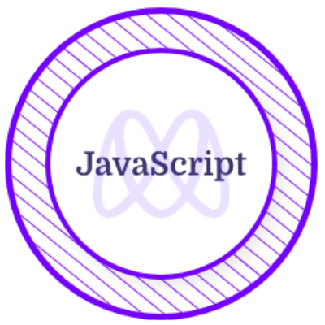
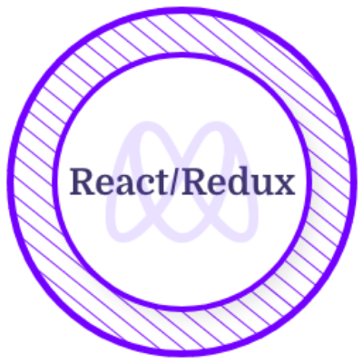
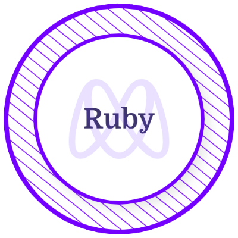

<h1>👋 Hi there, I'm Hassan EL OUARDY</h1>

<h3>
Full-Stack Developer | AI Enthusiast
</h3>

I’m a frontend-focused full-stack developer with a strong passion for building clean, scalable, and user-friendly web applications.  
I enjoy turning complex problems into simple, elegant solutions and I’m continuously improving my skills across frontend, backend, and AI-powered applications.

🌍 Based in Morocco • 💼 Open to new opportunities • 🏋️‍♂️ Gym enthusiast

  
  
  
  

### 🚀 About Me

- 🤖 Currently learning **AI & Machine Learning** (ML fundamentals, data processing, AI-powered features)
- 🎓 Certified full-stack developer from [Microverse](https://github.com/microverseinc)
- 🔭 Currently working on **full-stack projects** (React / Next.js / APIs)
- ⚛️ Frontend focus: **FastAPI, React, Next.js, TypeScript, Tailwind CSS**
- 🧠 Backend experience with **Ruby on Rails, Express.js, Spring Boot**
- 🌍 Experienced in **remote collaboration** with international teams
- 🎓 Background in **Electrical Engineering**, now fully transitioned to software development
- 🌐 Languages: **Arabic, French, English**
- 📫 Reach me at: **hassan.elouardy06@gmail.com**

---

### 📫 Contact Me ⬇️

  
  
  

---

### 🛠 Languages & Tools

## 

<h2 align="left">📜 Certificates</h2>

  
  
  
  
  

<h2 align="left">📊 GitHub Stats</h2>

## 📊 GitHub Activity

[]

